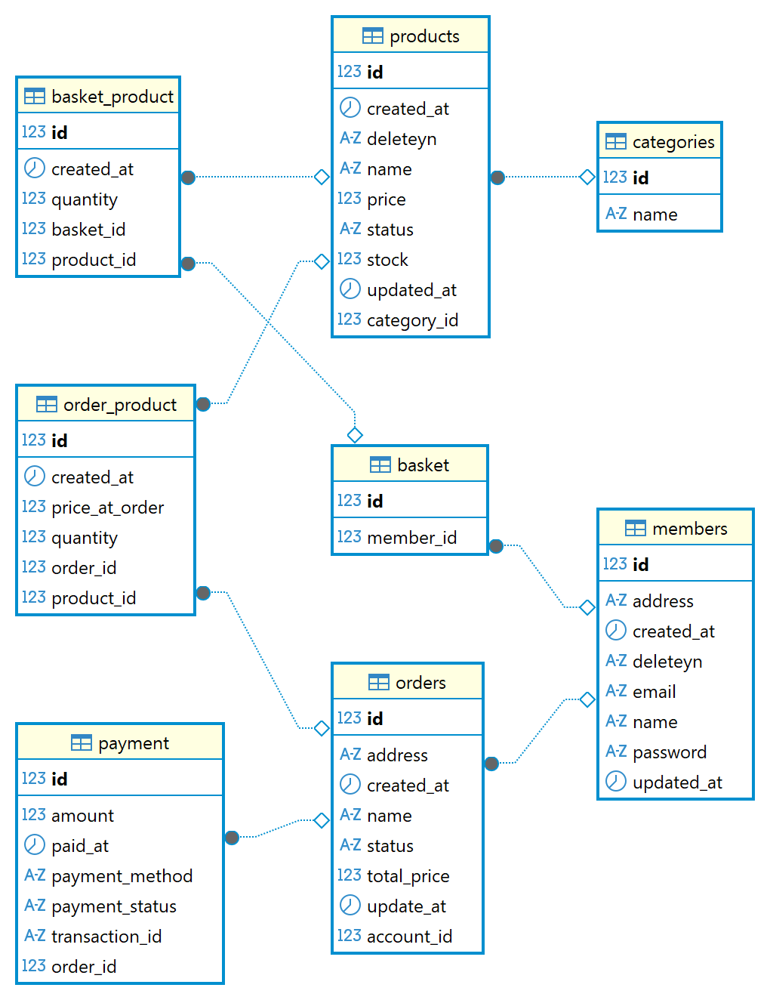

## 📌 프로젝트 개요
```
java version: 17
spring boot version: 3.4.12
Mysql version: 8.0 (8.0.44)

1. 상품 조회, 장바구니 관리, 주문 및 결제 기능 생성
2. 테스트 코드 생성(결제 관련 테스트 코드는 생성하지 못함)  
3. 프로젝트 실행 시, 세션 내에 로그인 정보가 주입되도록 설정
```
---
## 🔗 프로젝트 진행 과정 정리
- 설계 및 구현 과정 상세 문서\
 👉https://puzzled-detail-b29.notion.site/market-backend-api-2d4505fe62238003bc7fced5e6d30e48?source=copy_link

---

## 🔧 실행 방법

### 1️⃣ MySQL Docker 구동
- 프로젝트 최상위에서 실행
- 초기 database 생성 및 ddl, insert 쿼리 실행
```
docker compose -f ./docker/compose.yml up --build -d
```

### 2️⃣ 의존성 설치

```
./gradlew clean build
```

### 3️⃣ Spring Boot 실행

```
./gradlew bootRun
```

### 4️⃣ 세션에 등록된 사용자 관련 정보
```
memberId: 1
basketId: 1
```

---

## ✨ 주요 기능

### 🛒 장바구니
- 장바구니 생성 및 조회
- 장바구니에 상품 추가
- 수량 변경
- 품절 상품 표시 처리

### 🛍 상품
- 상품 목록 조회 (페이지네이션)

### 📦 주문
- 주문 생성
- 결제 상태(PENDING, APPROVED 등) 관리
- 결제 진행

---

## ERD

### 전체구조
- 서비스 도메인과 테이블 간 관계를 한눈에 파악할 수 있도록 ERD를 정리했습니다.


---

## 🧪 테스트

테스트는 JUnit5 기반이며 기능 단위로 구성되어 있습니다.

각 테스트는 다음을 검증합니다:

- Service 레이어 단위 비즈니스 검증
- 상품/장바구니/주문 데이터 흐름 검증
- JPA 연관관계 및 Cascade 동작 테스트

---

## 📂 Project Structure

```
### 세부 패키지 구성

#### 📌 `api`
- `MemberApi`, `ProductApi`, `BasketApi`, `OrderApi` 등
- Request/Response DTO 분리
- 표준화된 Response 구조 제공

#### 📌 `application`
- 각 기능별 Service
    - `MemberService`
    - `ProductService`
    - `BasketService`
    - `OrderService`

#### 📌 `domain`
- 도메인 중심 설계  

```

---

## 🚀 Tech Stack

| Category | Stack |
|---------|-------|
| **Language** | Java 17 |
| **Framework** | Spring Boot |
| **Database** | MySQL 8 |
| **ORM** | JPA / Hibernate |
| **Build Tool** | Gradle |
| **Test** | JUnit5, SpringBootTest |
| **Tooling** | Lombok, Validation, Docker Compose |